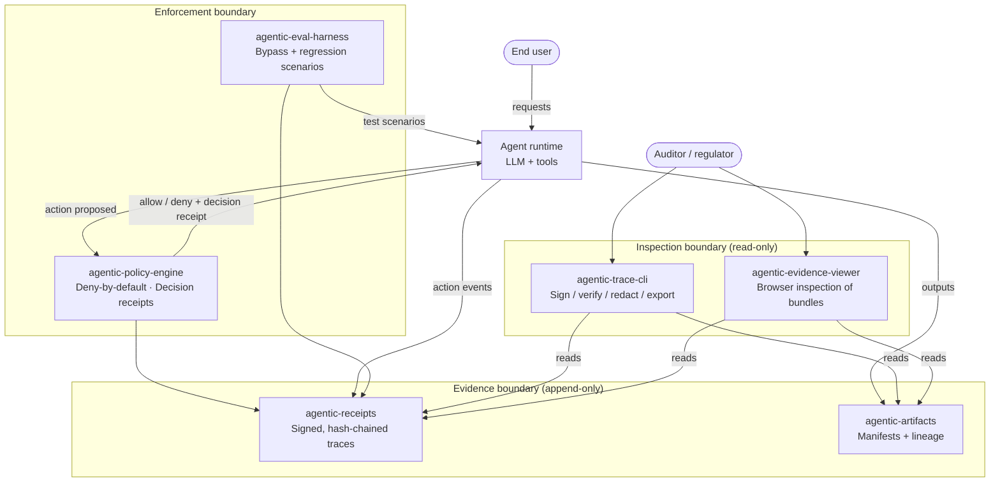
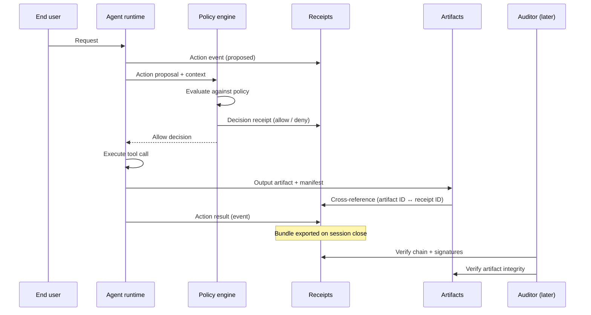

# Evidence Suite — Reference Architecture

> Pre-release draft. Pins architectural positions for v0.1 component implementations. Companion to the v1.0 whitepaper.

## §1. Abstract

The Evidence Suite is a six-component reference architecture for agentic AI systems that must produce verifiable evidence of execution. It treats every agent action and every governance decision as a signed, hash-chained, canonicalized receipt; bundles those receipts with their associated artifacts; and lets a third party verify the bundle offline without trusting the producing system.

This document is the canonical entry point for architects, staff engineers, and CTOs evaluating the suite for adoption. It defines the three trust boundaries the architecture preserves, the six components that compose into them, the data flow through a single agent run, and the architectural positions taken for the v0.1 release line.

*Figure 1 — Evidence Suite system architecture. Three trust boundaries (enforcement, evidence, inspection) compose six components into a verifiable execution path. External actors interact only at the perimeter; data flows inward to evidence and outward to inspection, never in reverse.*

## §2. The verifiability gap

When an agent system makes a consequential decision — routes a clinical recommendation, allocates capital, denies an authorization, escalates a case — and an auditor later asks *"can you prove this happened the way you say it did?"*, the answer must come from evidence, not from confidence. The observability stack inherited from microservices was built for a different question. Spans, structured logs, and metrics tell engineers *"is the system healthy and did the deploy work?"* They are not architected to answer *"is this specific record an authentic, complete, ordered account of what occurred?"* That gap matters increasingly as agents move into regulated domains, where audit-trail durability is a control rather than a nicety.

The verifiability gap, stated precisely, has three components.

**Completeness.** A trace cannot prove omission of a sibling event. If an action occurred but its log line was sampled, dropped, or quietly suppressed, downstream consumers have no signal that the gap exists. Auditors are trained to look for the absence of records, but conventional observability stacks do not produce records that are checkable for absence. A regulator asking *"show me every tool call in this session"* cannot get a verified answer from a log aggregator — only the answer the aggregator happens to have.

**Ordering and integrity.** Timestamps assigned at emission, collection, and storage are not tamper-evident. Replay, reordering, or partial edits leave no detectable seam in conventional logs. The cost of the assumption "logs are immutable in production" is paid the first time an internal investigation needs to prove they weren't edited — and the proof, more often than not, has to come from inference about access controls rather than from the record itself.

**Authorship.** A log line *says* it came from a service. It does not cryptographically prove which binary, build, or signing identity emitted it. An adversary, or an honest engineer with mistaken access, can produce records that look identical to authentic ones. The audit question *"is this the record the agent emitted, or one the operator typed?"* has no log-layer answer.

Existing standards address pieces of this. OpenTelemetry standardizes the transport and semantic conventions for execution records, but does not sign or chain them. SLSA gives provenance for software supply chains — how an artifact came to exist — but not what the artifact did once running. W3C Verifiable Credentials provide tamper-evident claims at human-discrete cardinality, not the thousands-per-session execution volume agents produce. The Model Context Protocol describes how a model connects to tools but says nothing about the evidence trail of the call. CloudEvents wraps events in a common envelope; envelopes travel, but they do not prove what was inside them weeks later.

The Evidence Suite occupies the gap between what these standards describe and what regulated agent execution must answer for: *did this agent take this action under this policy, and is the evidence durable and portable enough that a third party can verify it without trusting us?*

## §3. Design principles

Five principles guide the design choices throughout the suite. They are deliberately opinionated; alternatives were considered and rejected, and the ADRs in component repositories carry that history.

**Verifiability over flexibility.** The suite treats *verifiable-by-construction* as the load-bearing property. When a design choice trades flexibility for verifiability — for example, requiring canonicalized JSON serialization that hashes identically across implementations, even at the cost of permissive parsing — verifiability wins. Flexibility added on top of a verifiable substrate composes; verifiability bolted onto a flexible substrate becomes a perpetual cleanup project. The choice shows up most visibly in the canonicalization rules in `agentic-receipts/spec/`: whitespace, key ordering, float representation, and UTF-8 normalization are pinned down so that two correct implementations produce byte-identical output for the same input.

**Append-only by cryptographic property.** Append-only is enforced through hash-chain integrity, not through storage promises. Each receipt references the prior receipt's hash; dropping or reordering records breaks the chain mathematically, regardless of where the data lives. Storage layers are advisory ("append-only-recommended") rather than mandatory, because the chain catches violations downstream. This means adopters can use ordinary object storage, ordinary filesystems, or specialized transparency logs interchangeably — the verifiability property is in the records, not in the storage layer's promises. Defense-in-depth (genuine append-only storage) is welcome; reliance on storage as the *only* enforcement is rejected.

**Deny-by-default at the policy boundary.** A missing policy is a denial. Allow-by-default with deny rules is rejected because it converts every undocumented agent action into an implicit grant, and undocumented grants accrete invisibly until an audit. Deny-by-default forces every privilege to be a written, signed decision — which is also what regulators expect to see when they ask *"under what authority did this action occur?"* The architectural cost is that policy authoring becomes a precondition rather than a follow-up, but in regulated contexts this is a feature: the act of writing the policy is itself part of the controlled change-management surface.

**Separable components, contractual interfaces.** The six components compose by contract — schemas, signatures, hash references — not by runtime coupling. A team can adopt receipts without the policy engine, the policy engine without the evaluation harness, or the viewer alongside an entirely different agent stack. Separable components survive the inevitable churn of agent runtimes; tightly-coupled ones die when the runtime changes. The contract surfaces are deliberately narrow — a JSON schema, a signature scheme, a hash-chain rule — so that an alternative implementation of any single component can drop in without coordination.

**Adjacent to standards, not redundant with them.** The suite is designed to coexist with OpenTelemetry, SLSA, W3C VC, MCP, and CloudEvents — not to replace any of them. Receipts cross-reference OTel traces; artifacts link to SLSA provenance; bundles can ride CloudEvents envelopes. The adoption story is *"add this layer to your existing stack,"* not *"rip out and replace."* The interop posture is one of the strongest signals that the suite is intended for production environments rather than greenfield experimentation: the existence of an OTel pipeline should not be an obstacle to evidence, and the suite's design assumes one is already in place.

## §4. System architecture

The suite organizes its six components into three trust boundaries. Each boundary has an explicit information flow direction, an explicit set of properties the architecture preserves, and an explicit relationship to the boundaries on either side of it.

**Enforcement boundary.** Contains `agentic-policy-engine` and `agentic-eval-harness`. Sits inline in the agent's execution path and gates what the agent attempts. Information flows *into* the boundary as proposed actions and contextual metadata; information flows *out* as allow/deny decisions plus decision receipts written to the evidence boundary. Bypassing this boundary is, by construction, ungoverned execution; the architecture does not pretend a parallel reporter is equivalent to a gate. The eval harness sits in the same boundary because it tests the gate's properties — bypass scenarios, injection scenarios, regression in policy enforcement — using the same enforcement-point hooks the runtime engine uses, so the harness's assertions are valid against the system as deployed rather than against a mocked stand-in.

**Evidence boundary.** Contains `agentic-receipts` and `agentic-artifacts`. Receives a unidirectional write stream of signed records: action receipts from the agent runtime, decision receipts from the policy engine, scenario-result receipts from the eval harness, and artifact manifests from any component producing output objects. The boundary's invariant is *append-only-by-chain* — the cryptographic chain detects any violation regardless of storage layer. Reads from this boundary go only outward, to the inspection boundary; reads back into the agent runtime are an antipattern that breaks the trust model, because a runtime that can read its own evidence can selectively choose which records to acknowledge in subsequent decisions. The asymmetry is intentional and load-bearing.

**Inspection boundary.** Contains `agentic-trace-cli` and `agentic-evidence-viewer`. A strictly read-only surface for auditors, regulators, internal reviewers, and any party verifying a bundle. Tools in this boundary cannot write to the evidence boundary; that asymmetry is what makes *"show me everything you have on this run"* a safe operation that does not contaminate the record. The CLI and viewer share a bundle-format contract: anything the CLI exports, the viewer can open; anything the viewer renders, the CLI can verify on the command line.

The boundaries are conceptual, not necessarily process-isolated. A team running everything in one process is not violating the architecture so long as the *interfaces* between boundaries are honored — writes only flow inward to evidence, reads only flow outward to inspection, and the policy engine sits inline with execution. Larger deployments tend to materialize the boundaries as actual process boundaries (separate services, separate persistence, separate authentication), but this is an operational choice, not an architectural requirement.

The canonical enforcement point is the **tool-call boundary**: the moment an agent attempts to invoke an external action against a registered tool. This is the universally-meaningful semantic boundary across agent frameworks. Agent-action boundaries are framework-coupled — what counts as one "action" varies by runtime, and policies written against one runtime's notion of an action cannot be carried to another. LLM-completion boundaries are too late; the model has already produced output and any policy decision now is post-hoc filtering rather than enforcement. The tool-call boundary is the moment the agent's intent meets the outside world: it is the first point at which a well-defined, framework-independent unit of agency exists, and the last point at which a denial actually prevents an external effect.

The policy engine is callable at other boundaries when an adopter has reason to gate elsewhere. An organization may also gate at the LLM-prompt boundary for prompt-injection containment, or at the tool-result boundary for output filtering. These are configurable enforcement points; the suite does not mandate where policy is called, only that the canonical recommendation, the conformance-vector test target, and the default integration shape are at tool-call.

## §5. Components
Each component is a standalone open-source repository with its own spec, test vectors, and (in the v0.1 release line) tagged release. The lanes below name what each component owns and, equally important, what it does not own — the second half is what makes the components composable rather than entangled.

### 5.1 `agentic-receipts` — the spec layer

**Owns:** the data model for action receipts and decision receipts, canonicalization rules (whitespace, key ordering, float handling, UTF-8 normalization, escape sequences), the hashing scheme (SHA-256 by default), the signing scheme (Ed25519 by default with a planned dual-signature post-quantum migration path through Dilithium3 or equivalent), redaction-with-integrity rules, the threat model, and the conformance vector library that any compliant implementation must pass.

**Does not own:** transport, storage, runtime execution, policy evaluation. Receipts is a *specification* repository; concrete implementations live elsewhere and conform to its vectors. The spec deliberately under-specifies operational concerns — there is no canonical receipt store, no canonical signing service, no canonical key management — because those are deployment decisions that vary by adopter.

**Why it sits at the top of the suite.** Every other component either produces receipts (policy engine emits decision receipts; eval harness emits scenario receipts), references receipts (artifacts link to the receipts that produced them), reads receipts (CLI and viewer verify and inspect), or tests against scenarios that require receipts (the eval harness's contracts assume receipts exist). The spec sets the contract; implementations diverge only where the spec permits. Conformance vectors are the discipline: an implementation that does not pass them is not part of the suite.

**Spec location.** `agentic-receipts/spec/` carries the schema documents, canonicalization rules, threat model, and (in v0.1) a versioned `vectors/` directory with conformance test cases. The threat model is the document with the largest blast radius — it pins down what the receipts protect against and what they don't, and the rest of the spec follows from those choices.

### 5.2 `agentic-policy-engine` — the gate

**Owns:** deny-by-default policy evaluation, decision-receipt emission for both allows and denies, integration adapters for common agent runtimes, and a minimal declarative policy rule format expressed as a JSON ruleset. The engine's evaluation contract is a pure function: given a proposed action, the agent's context, and a policy ruleset, produce an allow/deny decision plus a signed decision receipt that records the inputs, the matched rule (or absence thereof), and the outcome.

**Does not own:** the receipt schema (consumes it from `agentic-receipts`), storage of decisions (writes to the evidence boundary), or runtime execution (sits inline with it but does not own it). The engine is deliberately stateless between evaluations; any state — counters, budgets, session context — that policies depend on is passed in as part of the context payload, so the same evaluation given the same inputs produces the same outputs and the same signed receipt.

**Decision-receipt symmetry — every allow and every deny emits a receipt — is a deliberate choice.** Many policy systems log only denials. That asymmetry leaves a quiet failure mode: *"we allowed this because no policy was matched"* becomes invisible. Symmetric receipts make every authority decision a written, signed record, including the boundary cases where authority was implicit. The cost is write volume — allows are far more common than denies — but the audit benefit dominates: an auditor reading a bundle can answer *"under what authority"* for every single action, not just the rejected ones.

### 5.3 `agentic-eval-harness` — the regression layer

**Owns:** scenario authoring methodology, the five canonical scenario classes (bypass, injection, exfiltration, determinism, budget), regression gate thresholds, the runner that executes scenarios against an agent under test, evidence-bundle export of scenario runs, and a continuous-integration harness for catching regressions in policy enforcement and evidence emission. The harness produces its own receipts as it runs, so a regression run is itself an auditable artifact.

**Does not own:** runtime governance (uses, but does not provide, the policy engine; uses, but does not produce, action receipts). The harness is the test framework, not the system under test, and its outputs are evidence of *the system's verifiability*, not of the system's correctness on the actual tasks.

**Why it ships with the suite, not separately.** Verifiable execution is not a property an agent is born with; it is a property maintained against drift. New tools added to an agent introduce new bypass paths; new model versions introduce new injection surfaces; refactors of the policy engine can silently degrade enforcement coverage. The eval harness is what catches the regression before it ships, and it does so against the same policy boundary the production runtime uses, so its findings are binding rather than suggestive.

### 5.4 `agentic-artifacts` — the lineage layer

**Owns:** artifact manifest schemas, integrity-hashing rules for output objects (files, structured data, generated documents), provenance linkage between receipts and the artifacts they reference, and the data-lineage contract that connects an action receipt to the artifact it produced. The manifest is a small, signed envelope that names the artifact, hashes its contents, references the receipt that produced it, and (when applicable) cross-references the SLSA provenance of the agent runtime that ran the action.

**Does not own:** runtime execution, runtime artifact storage, or build-time provenance. Artifacts records the *runtime* lineage of agent outputs; SLSA records the *build-time* lineage of the agent itself. The two compose: an output artifact has a runtime lineage (which receipt produced it) and a build-time provenance (which agent binary produced the runtime that produced it).

**Why lineage and provenance are separated in this suite.** The term *provenance* is used by `agentic-receipts` for action provenance — *what an agent did, signed*. `agentic-artifacts` uses *data lineage* for object lineage — *what data flowed where, hashed*. Conflating the two is one of the most common mistakes in this design space; the upcoming `GLOSSARY.md` formalizes the distinction. Adopters who previously thought of provenance as a single concept usually find the separation clarifying once they read the threat model: the two have different adversary models and different verification flows.

### 5.5 `agentic-trace-cli` — the developer surface

**Owns:** a Rust command-line tool implementing the receipt operations: `init` (create a bundle skeleton), `append` (add a canonicalized, hashed, chained receipt), `sign` (apply the signing key), `verify` (schema + chain + signature checks), `redact` (selective field removal preserving hash integrity), and `export` (produce a bundle suitable for handoff). The CLI is the reference implementation for the receipt spec; the conformance vectors test the CLI directly, so anything the CLI passes is a binding statement about what the spec actually means.

**Does not own:** policy evaluation, artifact storage, or UI. The CLI is the *engineer's* tool; the viewer is the *auditor's* tool. The two share the bundle format but optimize for different consumers — engineers want exit codes and JSON output; auditors want a browsable UI with redaction-aware display.

**Why Rust.** Memory-safety and a single static binary that runs anywhere are valuable for a tool that auditors will eventually carry between organizations. The CLI is a portable verifier as much as it is a development utility — an auditor with a USB stick and the binary can verify a bundle on a sealed laptop, with no network and no language-runtime dependency. Cross-platform release builds for macOS and Linux are planned for the v0.1 release line.

### 5.6 `agentic-evidence-viewer` — the auditor surface

**Owns:** a browser-based UI for inspecting bundles. Drag-and-drop import; client-side schema validation, signature verification (via WASM or pure-TypeScript verifier), and hash-chain traversal; per-event detail views with redaction-aware display showing both *what is hidden* and *why*; a metrics summary panel; a scenario pass/fail badge; and an artifacts explorer with safe previews for common file types.

**Does not own:** authoring, signing, or storage. The viewer is *strictly read-only* and runs entirely client-side, with no server dependency. A user opens the viewer in a browser, drops a bundle on it, and the verification happens locally — there is no upload, no account, and no telemetry.

**Why client-side.** An auditor surface that requires logging into the producer's infrastructure is not an auditor surface. The viewer's read-only, no-server, no-account design is what makes *"open this bundle and verify it"* a real operation rather than a demo. The deployment path is a static site on GitHub Pages, so the URL the auditor visits is owned by the project, not by any single adopter — the trust model reduces to *trust the public-key disclosure and the static site you visited*.

## §6. Data flow

A single agent run produces a bundle through a deterministic sequence. Following one request through the architecture clarifies how the boundaries interact and where the verifiability guarantees come from.

*Figure 2 — Single-run data flow. Receipts capture the proposed action, the policy decision, and the action result; artifacts cross-reference the receipts that produced them. Verification is offline, against the bundle.*

The flow makes several invariants concrete.

**Receipts are emitted before and after action execution, not just after.** An action's *proposal* is recorded, then the *decision*, then the *result*. If execution fails or is interrupted, the receipts already record what was attempted and what was decided — the failure becomes part of the verifiable history rather than a gap. This is not free; it imposes the discipline that nothing the agent does is invisible to the chain. The discipline is what makes completeness checkable.

**The cross-reference between artifacts and receipts is bidirectional in the bundle but unidirectional in time.** A receipt is written first; the artifact is written next, referencing the receipt; the receipt's downstream consumers find the artifact via the bundle's manifest. There is no circular dependency at write-time, which means the writes are linearizable and the chain integrity is preserved even if the artifact and receipt streams are in different storage backends.

**Bundle export is a single operation.** A bundle is the canonical exchange unit: receipts in a JSONL chain, decision receipts cross-referenced from action receipts, artifact manifests with integrity hashes, and a public-key reference that names the signing identity. The CLI's `export` command and the viewer's drop target consume the same bundle format. A bundle is intended to be self-contained: an auditor with the bundle and the publicly-disclosed signing key needs nothing else to verify it.

**The bundle's file layout.** A bundle is a directory (or zipfile) containing `receipts.jsonl` (the chained action and decision receipts), `artifacts/` (a directory of artifact files with `*.manifest.json` siblings), `bundle.json` (the bundle-level manifest naming the signing identity, the receipt-chain root hash, and the bundle's own version), and an optional `metadata/` directory for non-load-bearing context. The format is canonicalized in the same sense the receipts are: a correctly-built bundle of a given run hashes identically across implementations, which makes bundle-level signatures meaningful.

**Verification is offline.** The auditor needs the bundle and the issuing public key. Nothing else. This is what turns receipts from a private ledger into portable evidence. The verification sequence is deterministic: parse the bundle manifest, fetch and verify the public-key history (from the disclosure URL), verify the bundle's top-level signature against the named key, walk the receipt chain checking hashes and per-receipt signatures, verify each artifact manifest against its file contents, and (optionally) verify the cross-references between receipts and artifacts. A failure at any step is a verification failure with a specific, named cause.

The OpenTelemetry relationship is by **cross-reference, not embedding**. When OTel is also in use, receipts and OTel spans live in parallel record streams, with `trace_id ↔ correlation_id` correlation. Embedding signed receipts inside span attributes was considered and rejected: span sampling would lose receipts, span size limits would truncate them, and the receipt's standalone verifiability is obscured when it lives only inside a span. Parallel streams preserve both lifecycles — observability and evidence — without entangling them. An adopter running OTel keeps it; the suite adds a separate stream that cross-references rather than replaces.

## §7. Trust boundaries and threat assumptions

The architecture's trust model is necessarily explicit about what is trusted, what is not, and where the verifiability claims actually hold.

**Trusted.** The agent runtime is trusted to emit honest receipts; signing keys live in-process. This matches the deployment shape of nearly all current regulated AI systems: the operator owns the runtime and is the signing principal. The threat model treats *malicious runtime* as a separate adversary class addressed in extension scenarios, not as the default v0.1 assumption. A v0.2 path for trusted-execution-environment-backed signing is sketched in the threat model but not in scope for v0.1.

**Not trusted.** The transport between the runtime and storage; the storage layer's append-only promise (the chain enforces append-only, not the storage); any reader downstream of the bundle (verification is by signature and chain check, not by trust); the bundle's metadata fields (only the signed portions are load-bearing).

**Verifier-side trust.** The verifier needs to trust the public key associated with the signing identity. This is where a v0.1 key disclosure story is load-bearing. The suite recommends publishing signing public keys in a versioned manifest in the meta-repository or at a well-known URL controlled by the operator, with key rotation handled through a signed key-history file that itself chains. A verifier's first step is to fetch and verify the key history; their second is to verify the bundle against the appropriate key for the time period the bundle covers. The disclosure mechanism is intentionally outside the bundle: a bundle can be verified offline against a key the verifier already has, and the key history is a separate document with its own update cadence.

**Key rotation in detail.** The key-history file is itself a hash-chained, signed record: each entry names a key (or a key-rotation event), the time range it was valid, and references the prior entry's hash. A new key is introduced by a rotation entry signed by the *previous* key, and from that point on bundles signed by the new key chain to the previous one through the key-history. Compromise of a current key invalidates only bundles signed during the compromise window, not the entire historical record — which is what makes long-lived audit trails survive routine key-management events.

**Adversary capabilities.** The threat model assumes an adversary can tamper with bundles in transit or at rest (defeated by signatures and chain), drop or reorder records in storage (defeated by chain), synthesize records claiming to come from a known signer (defeated by signatures, given key custody), and compromise an old signing key (mitigated by key rotation; bundles signed pre-compromise remain trustworthy if the rotation timeline is known).

The threat model assumes the adversary **cannot** compromise the runtime's current signing key without detection — this is the load-bearing assumption, and runtime key custody is therefore a deployment concern that adopters address through their own infrastructure (HSM, KMS, key-management service). The model also assumes SHA-256 collision resistance and Ed25519 forgery resistance hold within the v0.1 timeframe, with the post-quantum migration path planned for the v0.2 line.

**Worked example: a tampered-record scenario.** An operator suspects a contractor edited a receipt to remove a denied action. The verifier opens the bundle in the viewer; the chain hash check fails at the position of the edit because the next receipt's `previous_hash` no longer matches the tampered record. The viewer flags the failure with the receipt index, the expected hash, and the observed hash. The operator now has a cryptographic claim — not an inference — that tampering occurred, and a specific record to subpoena for further investigation. Without the chain, the same investigation would rely on log-aggregator access logs and storage-layer audit records, both of which are themselves editable; the chain gives the investigator a primary record that does not depend on those.

**Where the model is weakest.** Cross-organization bundle interoperability — when Agent A (Organization X) calls Agent B (Organization Y) — is a known open problem. v0.1 expects bundles to be intra-organizational; cross-org composition requires a shared-custody model that is in active design, with candidate approaches (federated key disclosure, escrow signers, multi-party receipts) sketched in the threat model but not yet pinned. A deeper threat model — including signing-key compromise paths, replay attacks, redaction misuse, and the cross-org problem — is published in `agentic-receipts/spec/threat-model.md` and updated alongside the spec.

## §8. Non-goals

The suite is deliberately bounded. Things it explicitly does not try to be:

1. **Not a replacement for OpenTelemetry.** Receipts augment execution traces with signing and verification semantics, but the suite is not a general observability platform. Adopters keep their existing OTel stack; receipts cross-reference into it. The suite has no opinion about how spans are aggregated, sampled, or queried — those are observability concerns, and observability tools already do them well.

2. **Not an agent sandbox.** The policy engine gates *what* an agent attempts; it does not isolate *how* the attempt is executed. Sandboxing — whether through containerization, tool-side capability restriction, or runtime instrumentation — belongs to the agent runtime, not to this layer. A policy decision that says *"this tool call is allowed"* is a statement about authority, not about isolation guarantees.

3. **Not a prompt-injection detector.** The eval harness tests for injection scenarios, and receipts record what an agent did once injected. Neither prevents injection at runtime; that is a different layer of the stack with its own primitives (input filtering, prompt-shielding LLM techniques, pre-completion classifiers). The suite makes injection detectable after the fact, not preventable in the moment.

4. **Not a compliance certification.** The suite produces audit-trail evidence. Whether that evidence satisfies a specific regulatory regime (FDA 21 CFR Part 11, EMA Annex 11, GxP validation expectations) is between the operator and the regulator. The suite *enables* compliance arguments; it does not *issue* them. Mappings from suite outputs to specific regulatory control families are work in progress, published as adopters and regulators converge on them.

5. **Not general-purpose authorization.** The policy engine is scoped to agent-action authorization, not user-level RBAC, application-level entitlements, or service-mesh authz. Adopters keep their existing IAM stack; the policy engine sits between it and the agent's tool calls, gating *the agent's privilege to act* rather than the user's privilege to ask.

6. **Not a correctness oracle.** Receipts record what an agent *did*. Whether what it did was *correct* — whether the recommendation was right, whether the diagnosis was accurate, whether the routing was optimal — is orthogonal. The suite is about provability, not quality. An agent that consistently makes wrong-but-permitted decisions produces beautifully-verifiable receipts of those wrong decisions; that failure mode is owned by evaluation and human review, not by the evidence layer.

## §9. Extension and integration

Adopters integrate the suite with existing stacks rather than replacing them. The integration story for each adjacent standard is summarized below; the full mapping table publishes as `INTEROP.md`.

**OpenTelemetry.** Receipts run in parallel with OTel spans. The agent runtime emits both: a span for observability, a receipt for evidence. The two are linked through correlation IDs (the OTel `trace_id` corresponds to a receipt-chain `correlation_id`). When an auditor needs to trace from a regulatory finding back to an OTel span, the receipt-to-span link is the bridge; when an SRE needs to debug performance from the OTel side and pull the related evidence, the same link works in reverse. Embedding receipts inside spans was considered and rejected (see §6).

**SLSA.** Artifact manifests in `agentic-artifacts` are designed to compose with SLSA provenance. An agent's output artifact has a runtime lineage (which receipt produced it) and a build-time provenance (which agent binary produced the runtime that produced it). Adopters that already publish SLSA provenance for their agent runtime get a complete chain — from source repository through deployed binary through agent action through output artifact — with no schema work. The cross-reference is by SLSA subject digest; the manifest names the digest and the SLSA attestation's location.

**W3C Verifiable Credentials.** Specific receipts can be re-framed as VCs when a discrete, verifiable claim needs to flow through a VC-aware ecosystem (for example, an *"agent X was authorized to perform action Y at time Z"* credential issued to a downstream system). Day-to-day, the suite uses hash-chained receipts because VC overhead per claim is too high for execution-volume traffic. The framing transformation is documented in the interop mapping.

**Model Context Protocol.** A receipt is naturally one-per-MCP-tool-call. The policy engine gates at the tool-call boundary; the receipt records the call; the artifact records the output. MCP-based agent platforms get an evidence layer with no change to the protocol — the suite reads MCP's tool-call shape and produces a receipt without requiring MCP-specific spec extensions.

**CloudEvents.** Bundles can ride CloudEvents envelopes when transmitted across system boundaries. The envelope carries the bundle; the bundle's signatures and chain integrity survive transit. A CloudEvents receiver can extract the bundle and feed it directly into the viewer or CLI without any envelope-aware processing.

The integration patterns above are not exhaustive. The forthcoming `INTEROP.md` carries the full mapping table, the recommended integration shape for each standard, and worked examples for the common adoption paths.

## §10. Versioning and stability

The suite versions its components independently. Each component repository carries its own SemVer line; the meta-repository declares a *suite compatibility matrix* that names, for each suite version, the compatible range of each component.

**Why independent versions.** Lockstep versioning across six components is operationally expensive — every component bumps when one changes — and signals immaturity. SLSA, SPDX, CNCF projects, and most multi-component standards ecosystems version their components independently for the same reasons. Independent versioning lets the spec layer (`agentic-receipts`) evolve at the cadence of design work, while the implementation layers (`agentic-trace-cli`, `agentic-evidence-viewer`) evolve at the cadence of feature and bug-fix work.

**The compatibility matrix.** Published as `ROADMAP.md` and `VERSIONING.md` in this repository. The matrix names, for each suite version, the compatible range of each component, the stability classification (stable / experimental), and the deprecation window for any component or interface scheduled for change. An adopter targeting suite v0.1 can read the matrix and pin component versions accordingly; an adopter integrating with suite v1.0 in the future will read the v1.0 matrix and find a different — but explicitly stated — compatible set.

**Stability guarantees in v0.1.** Schemas declared in `agentic-receipts/spec/` carry stability through the suite v0.1 line — no breaking changes without a major bump and a stated deprecation window. CLI commands and viewer UI carry no stability guarantee in v0.1; surfaces stabilize at v1.0. Until each component carries a tagged v0.1.0 release with conformance vectors, adopters should treat all interfaces as unstable and pin to specific commit SHAs rather than semantic ranges.
